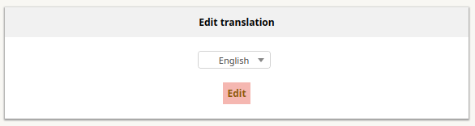
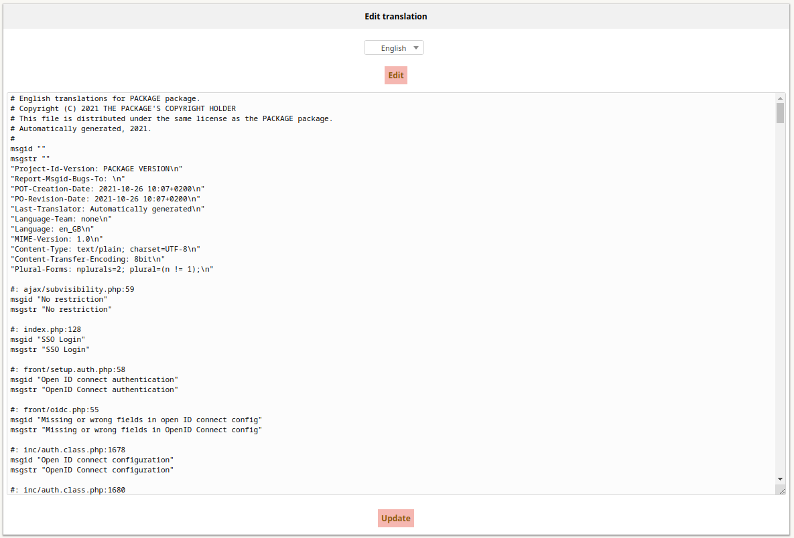

# ITSM Edittraduction

This plugin allows you to edit translation file directly in the web interface.

## Installation

Installing this plugin is done following the standard process for itsm plugins, simply clone the git or download a release and place it within itsm's `plugins` folder.

Don't forget to set Apache rights, and enjoy !

## Usage

Go to `Tools > Translation editor`.

Select the language you want to change and click on `Edit`.

You can use your browser's search functionality to more easily find the translation to edit (Ctrl+f).

Once your translation is found, modify only the `msgstr` field.

Click on `Update` and `Login/Logout`.

